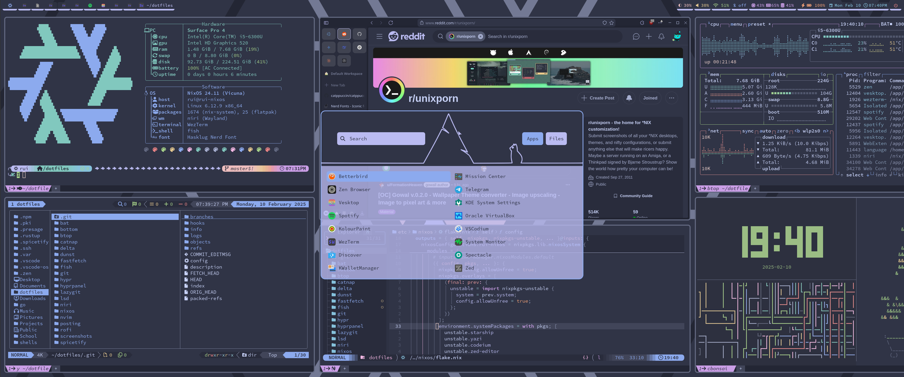
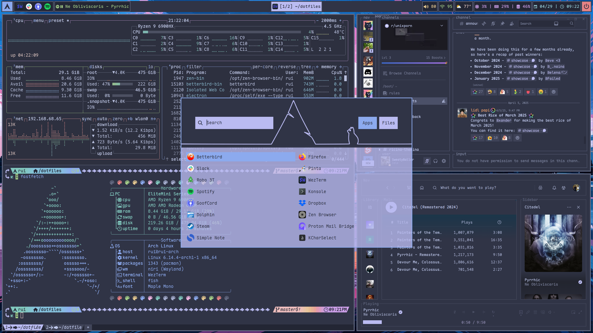
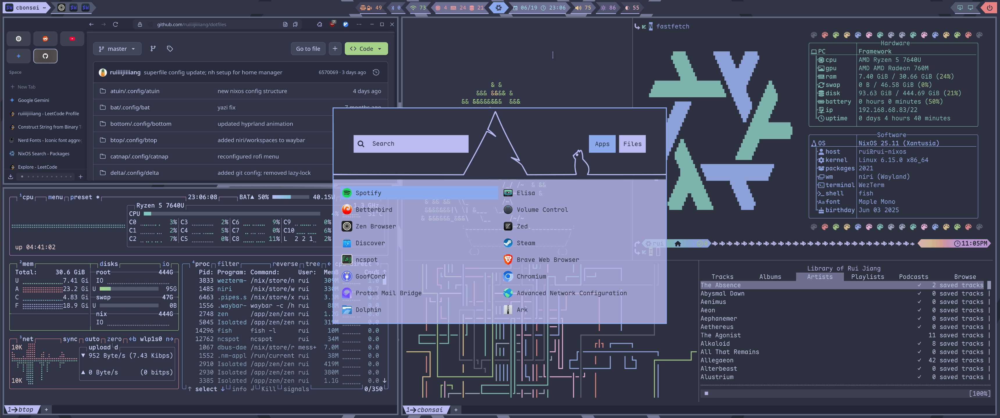

# Hello world

Thank you for checking out the configuration for my personal development environment. Feel free to borrow any ideas as you see fit. These are dotfiles I use specifically for my setup. They are not intended to be copied directly.

## Screenshots

  
Version 1

  Simple terminal setup

  
Version 2

  First attempt at Linux ricing with Hyprland and waybar

  
Version 3

  Reduced rainbow puke

  
Version 4

  Ditched waybar for hyprpanel

  
Version 5

  Added theme for spotify and discord

  
Version 6

  Reverted to waybar and rethemed

  
Version 7

  Better rofi theme

  
Version 8

  Some minor color adjustments

  
Version 9

  Moved to niri

  
Version 10

  Ditched NixOS; updated discord to the newest UI

  
Version 11 (current)

  Back to NixOS; new waybar design

## Theme

I am a big fan of the [Catppuccin](https://github.com/catppuccin) theme, specifically the frappe variant with lavender accent.
I prefer [Maple Mono](https://github.com/subframe7536/maple-font) for coding.

## Tools

Most of these tools should be readily available from the package manager of your choice, ie. homebrew, pacman, nixpkg, etc.
Neovim plugins are managed by LazyVim.

### Desktop Environment

- [niri](https://github.com/YaLTeR/niri)
- [waybar](https://github.com/Alexays/Waybar)
- [rofi](https://github.com/davatorium/rofi)
- [niriswitcher](https://github.com/isaksamsten/niriswitcher)
- [swaybg](https://github.com/swaywm/swaybg)
- [swaylock](https://github.com/swaywm/swaylock)
- [swayidle](https://github.com/swaywm/swayidle)
- [swaync](https://github.com/ErikReider/SwayNotificationCenter)
- [swayosd](https://github.com/ErikReider/SwayOSD)

### Development Environment

- [wezterm](https://github.com/wez/wezterm)
- [fish-shell](https://github.com/fish-shell/fish-shell)
- [neovim](https://github.com/neovim/neovim)
  - [LazyVim](https://github.com/LazyVim/LazyVim)
  - [snacks.nvim](https://github.com/folke/snacks.nvim)
  - [mini.nvim](https://github.com/echasnovski/mini.nvim)
  - [codeium.nvim](https://github.com/Exafunction/codeium.nvim)
  - [smart-splits.nvim](https://github.com/mrjones2014/smart-splits.nvim)
  - [codesnap.nvim](https://github.com/mistricky/codesnap.nvim)
  - [tiny-glimmer.nvim](https://github.com/rachartier/tiny-glimmer.nvim)
  - [reactive.nvim](https://github.com/rasulomaroff/reactive.nvim)
  - [dropbar.nvim](https://github.com/Bekaboo/dropbar.nvim)
  - [nvim-window-picker](https://github.com/s1n7ax/nvim-window-picker)
  - [nvim-scrollbar](https://github.com/petertriho/nvim-scrollbar)
  - [nerdy.nvim](https://github.com/2KAbhishek/nerdy.nvim)
  - [nvim-rip-substitute](https://github.com/chrisgrieser/nvim-rip-substitute)

### TUI Applications

- [file_clipper](https://github.com/ruiiiijiiiiang/file_clipper)
- [starship](https://github.com/starship/starship)
- [zoxide](https://github.com/ajeetdsouza/zoxide)
- [yazi](https://github.com/sxyazi/yazi)
- [lsd](https://github.com/lsd-rs/lsd)
- [pay-respects](https://github.com/iffse/pay-respects)
- [fd](https://github.com/sharkdp/fd)
- [fzf](https://github.com/junegunn/fzf)
- [systemctl-tui](https://github.com/rgwood/systemctl-tui)
- [bat](https://github.com/sharkdp/bat)
- [lazygit](https://github.com/jesseduffield/lazygit)
- [atuin](https://github.com/atuinsh/atuin)
- [stow](https://github.com/aspiers/stow)
- [btop](https://github.com/aristocratos/btop)
- [fastfetch](https://github.com/fastfetch-cli/fastfetch)
- [delta](https://github.com/dandavison/delta)
- [superfile](https://github.com/yorukot/superfile)
- [posting](https://github.com/darrenburns/posting)
- [dust](https://github.com/bootandy/dust)
- [ncspot](https://github.com/hrkfdn/ncspot)
- [noxdir](https://github.com/crumbyte/noxdir)
- [onefetch](https://github.com/o2sh/onefetch)
- [scooter](https://github.com/thomasschafer/scooter)

### GUI Applications

- [zen-browser](https://github.com/zen-browser/desktop)
- [zed](https://github.com/zed-industries/zed)
- [GoofCord](https://github.com/Milkshiift/GoofCord)
- [NeoHtop](https://github.com/Abdenasser/neohtop)
- [spicetify](https://github.com/spicetify/cli)
- [system24](https://github.com/refact0r/system24)
