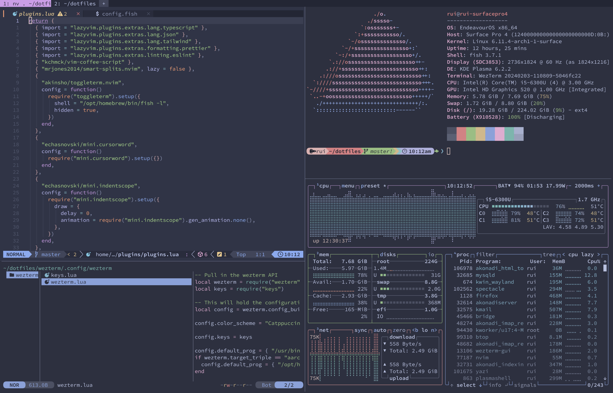
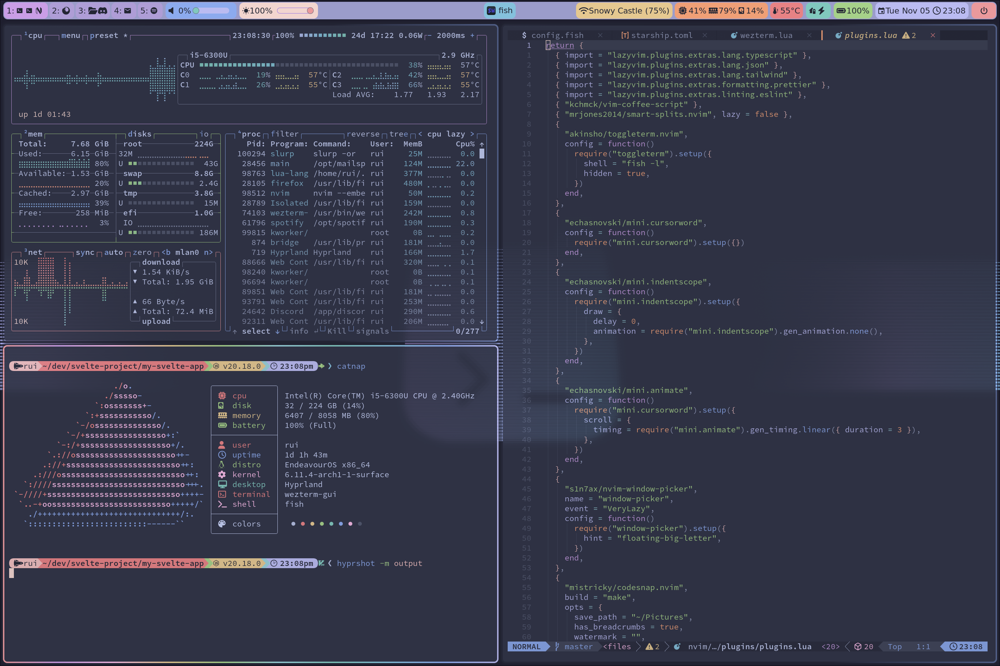
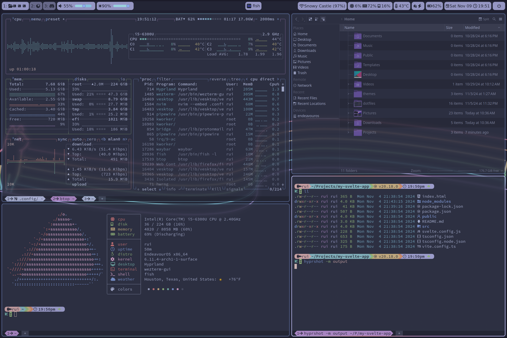
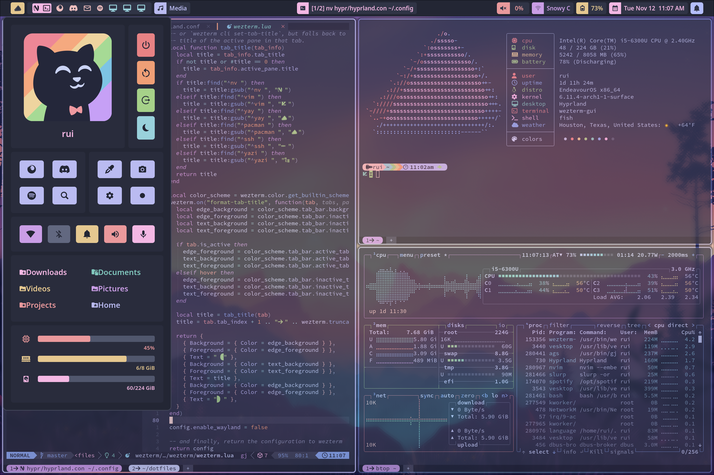
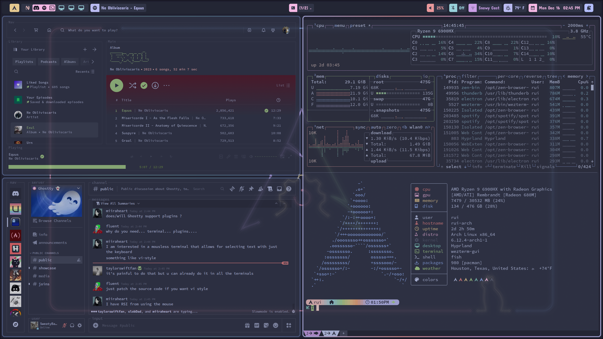
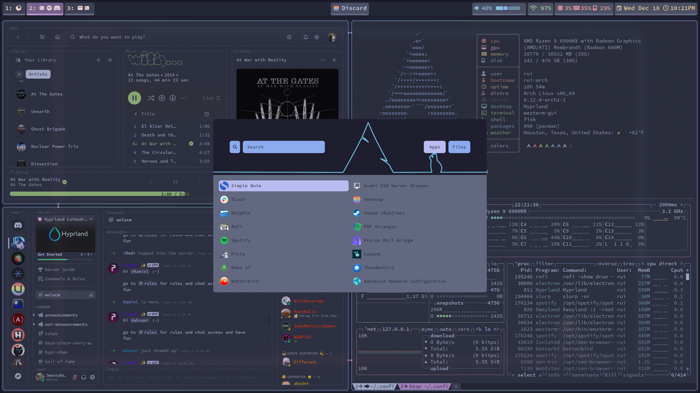
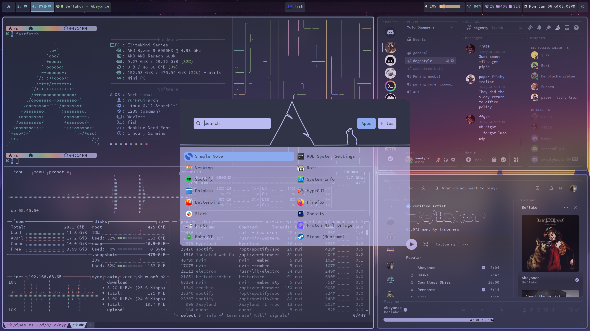
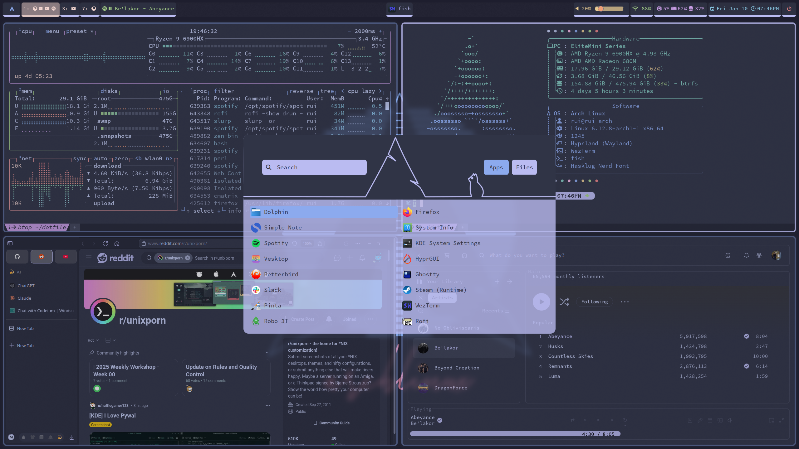

# Hello world

Thank you for checking out the configuration for my personal development environment. I am a full stack TS/JS engineer and I develop primarily using neovim. These are the dotfiles I use across Arch Linux and NixOS. I hope you find some inspiration here.

## Screenshots

  
Version 1

  Simple terminal setup

  
Version 2

  First attempt at Linux ricing with Hyprland and waybar

  
Version 3

  Reduced rainbow puke

  
Version 4

  Ditched waybar for hyprpanel

  
Version 5

  Added theme for spotify and discord

  
Version 6

  Reverted to waybar and rethemed

  
Version 7

  Better rofi theme

  
Version 8 (current)

  Some minor color adjustments

## Theme

I am a big fan of the [Catppuccin](https://github.com/catppuccin) theme, specifically the frappe variant.
I prefer [Hasklug Nerd Font](https://www.nerdfonts.com/font-downloads) for coding.

## Tools

Most of these tools should be readily available from the package manager of your choice, ie. homebrew, pacman, nixpkg, etc.
Neovim plugins are managed by LazyVim.

### Desktop Environment

- [hyprland](https://github.com/hyprwm/Hyprland)
- [hyprpanel](https://github.com/Jas-SinghFSU/HyprPanel)
- [waybar](https://github.com/Alexays/Waybar)
- [rofi](https://github.com/davatorium/rofi)

### Development Environment

- [wezterm](https://github.com/wez/wezterm)
- [fish-shell](https://github.com/fish-shell/fish-shell)
- [neovim](https://github.com/neovim/neovim)
  - [LazyVim](https://github.com/LazyVim/LazyVim)
  - [snacks.nvim](https://github.com/folke/snacks.nvim)
  - [mini.nvim](https://github.com/echasnovski/mini.nvim)
  - [codeium.nvim](https://github.com/Exafunction/codeium.nvim)
  - [smart-splits.nvim](https://github.com/mrjones2014/smart-splits.nvim)
  - [codesnap.nvim](https://github.com/mistricky/codesnap.nvim)
  - [tiny-glimmer.nvim](https://github.com/rachartier/tiny-glimmer.nvim)
  - [reactive.nvim](https://github.com/rasulomaroff/reactive.nvim)
  - [dropbar.nvim](https://github.com/Bekaboo/dropbar.nvim)
  - [animatedbg.nvim](https://github.com/alanfortlink/animatedbg.nvim)
  - [nvim-window-picker](https://github.com/s1n7ax/nvim-window-picker)

### CLI Applications

- [starship](https://github.com/starship/starship)
- [zoxide](https://github.com/ajeetdsouza/zoxide)
- [yazi](https://github.com/sxyazi/yazi)
- [lsd](https://github.com/lsd-rs/lsd)
- [thefuck](https://github.com/nvbn/thefuck)
- [fd](https://github.com/sharkdp/fd)
- [fzf](https://github.com/junegunn/fzf)
- [the_silver_searcher](https://github.com/ggreer/the_silver_searcher)
- [bat](https://github.com/sharkdp/bat)
- [lazygit](https://github.com/jesseduffield/lazygit)
- [stow](https://github.com/aspiers/stow)
- [btop](https://github.com/aristocratos/btop)
- [clipboard](https://github.com/Slackadays/Clipboard)
- [fastfetch](https://github.com/fastfetch-cli/fastfetch)
- [catnap](https://github.com/iinsertNameHere/catnap)

### Desktop Applications

- [zen-browser](https://github.com/zen-browser/desktop)
- [vesktop](https://github.com/Vencord/Vesktop)
- [spicetify](https://github.com/spicetify/cli)
- [system24](https://github.com/refact0r/system24)
